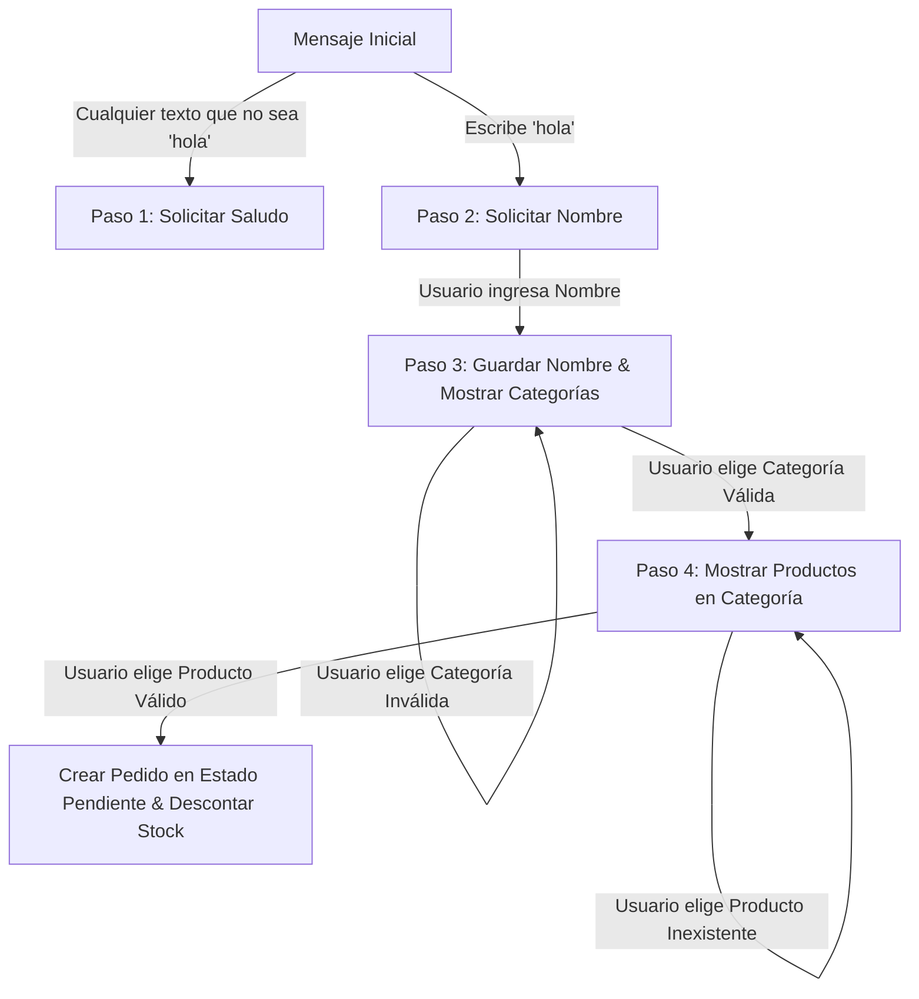

# Minibot - WhatsApp E-Commerce Chatbot Engine

`minibot` es un motor de chatbot transaccional e interactivo para WhatsApp, diseñado para actuar como una tienda virtual automatizada. Permite a los usuarios navegar por categorías de productos, consultar información en tiempo real, realizar pedidos de compra e interactuar mediante un flujo conversacional guiado y persistente.

---

## 📌 Tabla de Contenidos
1. [Características Principales](#-características-principales)
2. [Arquitectura y Stack Tecnológico](#-arquitectura-y-stack-tecnológico)
3. [Modelo de Datos (Esquema de Base de Datos)](#-modelo-de-datos-esquema-de-base-de-datos)
4. [Flujo de la Máquina de Estados (Conversación)](#-flujo-de-la-máquina-de-estados-conversación)
5. [Endpoints de la API](#-endpoints-de-la-api)
6. [Configuración y Levantamiento del Proyecto](#-configuración-y-levantamiento-del-proyecto)
7. [Integración con WhatsApp Cloud API (Meta)](#-integración-con-whatsapp-cloud-api-meta)

---

## 🚀 Características Principales

*   **Flujo Conversacional Persistente:** Controla el estado exacto de la sesión de cada usuario mediante una máquina de estados almacenada en base de datos.
*   **Catálogo Dinámico:** Permite a los clientes explorar categorías y productos activos, mostrando imágenes de los productos.
*   **Control de Stock Automatizado:** Al realizar un pedido, descuenta el stock en tiempo real verificando la disponibilidad.
*   **Webhook de Confirmación de Pedidos:** Endpoint seguro para confirmar o actualizar el estado de las solicitudes desde sistemas externos.
*   **Historial de Mensajes Completo:** Registra todos los mensajes de entrada (`in`) y salida (`out`) para auditoría y servicio al cliente.

---

## 🛠️ Arquitectura y Stack Tecnológico

El proyecto está estructurado como una aplicación monolítica backend ligera en Node.js:

*   **Entorno de Ejecución:** Node.js (configurado para usar Módulos ES `import/export`).
*   **Framework Web:** [Express](https://expressjs.com/) para el enrutamiento HTTP y el manejo de Webhooks.
*   **Base de Datos:** [PostgreSQL](https://www.postgresql.org/) como base de datos relacional.
*   **ORM / Query Builder:** [pg-promise](https://vitaly-t.github.io/pg-promise/) para gestionar las conexiones y transacciones SQL robustas.
*   **Cliente HTTP:** [Axios](https://axios-http.com/) para despachar mensajes a la API externa de WhatsApp de Meta.
*   **Variables de Entorno:** [dotenv](https://github.com/motdotla/dotenv) para aislar la configuración confidencial de producción.

---

## 🗄️ Modelo de Datos (Esquema de Base de Datos)

El sistema utiliza cinco entidades principales para coordinar la interacción con el cliente:

### 1. `contactos`
Registra el perfil básico de los clientes que inician una conversación.
*   `id` (Serial, Primary Key)
*   `telefono` (Varchar, Unique): Identificador único de WhatsApp del cliente.
*   `nombre` (Varchar): Nombre proporcionado por el usuario en el paso 2.
*   `creado_en` (Timestamp)

### 2. `mensajes`
Auditoría e historial de toda la interacción, además de almacenar el estado del paso conversacional del mensaje.
*   `id` (Serial, Primary Key)
*   `contacto_id` (Integer, Foreign Key -> `contactos.id`)
*   `direccion` (Varchar): `'in'` para mensajes recibidos del usuario, `'out'` para respuestas enviadas.
*   `texto` (Text): El contenido del mensaje.
*   `paso` (Integer): El número de paso del flujo conversacional en el que se grabó el mensaje.
*   `imagen_url` (Text, Opcional): URL de imagen si el mensaje contenía contenido multimedia.
*   `creado_en` (Timestamp)

### 3. `categorias`
Agrupa los artículos disponibles de la tienda virtual.
*   `id` (Serial, Primary Key)
*   `nombre` (Varchar, Unique): Ejemplo: "Electrónica", "Ropa".
*   `descripcion` (Text)
*   `activo` (Boolean)

### 4. `productos`
Los artículos individuales disponibles para venta.
*   `id` (Serial, Primary Key)
*   `categoria_id` (Integer, Foreign Key -> `categorias.id`)
*   `nombre` (Varchar)
*   `descripcion` (Text)
*   `imagen_url` (Text): URL pública de la foto del producto.
*   `stock` (Integer): Cantidad disponible.
*   `activo` (Boolean): Permite deshabilitar productos sin borrarlos.

### 5. `solicitudes`
Control de los pedidos generados por el flujo del Chatbot.
*   `id` (Serial, Primary Key)
*   `producto_id` (Integer, Foreign Key -> `productos.id`)
*   `contacto_id` (Integer, Foreign Key -> `contactos.id`)
*   `estado` (Varchar): `'pendiente'`, `'confirmada'`, `'cancelada'`, etc.
*   `evento_id` (Varchar): Identificador correlativo del pedido (formato `ev-001`, `ev-002`, etc.) o código de tracking.
*   `creado_en` (Timestamp)

---

## 🔄 Flujo de la Máquina de Estados (Conversación)

La conversación progresa dinámicamente según el estado almacenado del contacto:



### Detalle de Pasos:
1.  **Paso 1 (Introducción):** El usuario debe enviar **"hola"** para iniciar. Si envía cualquier otra cosa, el bot le solicita escribir "hola".
2.  **Paso 2 (Registro del Cliente):** El bot saluda y pregunta: *“¿Cómo te llamas?”*. La respuesta recibida se guarda en `contactos.nombre`.
3.  **Paso 3 (Selección de Categorías):** El bot da la bienvenida personalizada y lista las categorías activas. El usuario debe ingresar el nombre exacto de la categoría.
4.  **Paso 4 (Selección de Producto & Pedido):** El bot muestra los productos de esa categoría. Cuando el usuario escribe el nombre de un producto:
    *   Verifica la existencia y disponibilidad de stock.
    *   Reduce el stock en `-1`.
    *   Crea una fila en `solicitudes` con estado `pendiente` y le asigna un ID de evento (`ev-XXX`).
    *   Retorna un mensaje de éxito del pedido.

*Nota:* En cualquier momento, si el usuario escribe la palabra **"hola"** (incluso en pasos intermedios), el flujo se reinicia al Paso 2 solicitando nuevamente el nombre.

---

## 🔌 Endpoints de la API

El servidor Express expone las siguientes rutas:

### 1. Webhook de WhatsApp (Verificación)
*   **Método:** `GET`
*   **Ruta:** `/webhook/whatsapp`
*   **Descripción:** Utilizado por Meta durante la configuración inicial para verificar la autenticidad del webhook usando un token secreto.

### 2. Webhook de WhatsApp (Mensajería)
*   **Método:** `POST`
*   **Ruta:** `/webhook/whatsapp`
*   **Descripción:** Recibe las notificaciones de mensajes entrantes enviados por los clientes. Procesa el texto de la conversación y responde a través de WhatsApp.

### 3. Confirmación Externa de Pedidos
*   **Método:** `POST`
*   **Ruta:** `/webhook/confirmacion`
*   **Cabecera Obligatoria:** `x-webhook-secret` (Debe coincidir con la variable de entorno `WEBHOOK_SECRET`).
*   **Cuerpo (JSON):**
    ```json
    {
      "evento_id": "ev-001",
      "solicitud_id": 12
    }
    ```
*   **Descripción:** Cambia el estado de una solicitud de `pendiente` a `confirmada`. Adicionalmente, el bot le envía automáticamente un mensaje de confirmación por WhatsApp al cliente informándole que su pedido fue aprobado.

### 4. Consultar Solicitudes (Admin Backend)
*   **Método:** `GET`
*   **Ruta:** `/solicitudes`
*   **Descripción:** Retorna un arreglo JSON con todos los pedidos registrados en el sistema, detallando el teléfono del contacto, su nombre, el producto pedido, el estado actual y el ID del evento.

### 5. Test
*   **Método:** `GET`
*   **Ruta:** `/test`
*   **Descripción:** Endpoint rápido para comprobar conectividad del servidor (por ejemplo, al usar Ngrok).

---

## ⚙️ Configuración y Levantamiento del Proyecto

### Prerrequisitos
1.  **Node.js** v18 o superior instalado.
2.  Una base de datos de **PostgreSQL** disponible (local o en la nube como Supabase / ElephantSQL).

### Instrucciones de Instalación
1.  Clona el repositorio o ubícate en la carpeta raíz del proyecto.
2.  Instala las dependencias:
    ```bash
    npm install
    ```
3.  Crea un archivo `.env` en la raíz del proyecto basándote en el ejemplo proporcionado:
    ```bash
    cp .env.example .env
    ```
4.  Rellena los valores en el archivo `.env`:
    *   `DATABASE_URL`: Cadena de conexión de PostgreSQL.
    *   `WEBHOOK_SECRET`: Token de seguridad para validar peticiones a `/webhook/confirmacion`.
    *   `WHATSAPP_VERIFY_TOKEN`: Cadena secreta que tú elijas para emparejar el webhook en el panel de Meta developers.
    *   `WHATSAPP_TOKEN`: Access Token temporal o permanente generado desde la consola de Meta developers.
    *   `WHATSAPP_PHONE_NUMBER_ID`: Identificador de número de teléfono del portal de Meta.

### Ejecución en Desarrollo
Para iniciar la aplicación con reinicio automático al guardar cambios:
```bash
npm run dev
```
El servidor levantará en el puerto **3000** de manera predeterminada (`http://localhost:3000`).

---

## 🌐 Integración con WhatsApp Cloud API (Meta)

Dado que la API de WhatsApp requiere una dirección HTTPS pública para poder enviarte los mensajes, debes exponer tu entorno local a Internet:

1.  **Exponer con Ngrok:**
    Si no tienes instalado Ngrok, descárgalo e inicialízalo en el puerto 3000:
    ```bash
    ngrok http 3000
    ```
2.  **Configurar Webhook en Meta:**
    *   Ve a la consola de [Meta for Developers](https://developers.facebook.com/).
    *   Agrega el producto **WhatsApp** a tu aplicación.
    *   En la sección de configuración de Webhooks, pega tu dirección pública generada por Ngrok seguido de `/webhook/whatsapp` (Ejemplo: `https://xxxx-xx-xx.ngrok-free.app/webhook/whatsapp`).
    *   Coloca el token que definiste en tu archivo `.env` bajo `WHATSAPP_VERIFY_TOKEN`.
    *   Suscríbete al campo `messages` dentro de los Webhooks de WhatsApp para empezar a recibir notificaciones de mensajes entrantes.
