# Guía de Presentación del MVP - MiniBot CRM

Esta guía contiene la estructura del discurso (*pitch*), el guion paso a paso para la demo en vivo y los puntos clave a defender ante el tribunal o ingenieros.

---

## ⏱️ Estructura del Tiempo (Total: 5 - 7 Minutos)

```mermaid
gantt
    title Distribución de Tiempo del Pitch
    dateFormat  X
    axisFormat %M:%S
    section Presentación
    Introducción y Problema (1m) : 0, 60
    La Solución - MiniBot (1m) : 60, 120
    section Demo en Vivo
    Demo 1: Chat de WhatsApp (1.5m) : 120, 210
    Demo 2: CRM y Simulación de Pago (1.5m) : 210, 300
    Plan B: Simulador Local (1m) : 300, 360
    section Cierre
    Conclusión y Preguntas (1m) : 360, 420
```

---

## 🎤 Guion del Discurso (Script de Exposición)

### 1. Introducción y Problema (Minuto 0:00 - 1:00)
> *"Buenos días, señores del tribunal. En el comercio electrónico actual, el **90% de los clientes** prefiere comunicarse con los negocios a través de canales de mensajería directa como WhatsApp. Sin embargo, para las pequeñas y medianas empresas, es imposible mantener personal humano atendiendo mensajes 24/7 sin que se pierdan ventas por lentitud o errores. 
> 
> Las soluciones corporativas existentes suelen ser costosas, complejas de integrar y carecen de un control visual centralizado y ágil del inventario y las solicitudes."*

### 2. La Propuesta de Valor (Minuto 1:00 - 2:00)
> *"Para resolver esto, hemos desarrollado **MiniBot**: un MVP de chatbot transaccional conectado directamente a la **API Oficial de WhatsApp Cloud (Meta)**, sincronizado en tiempo real con una base de datos relacional robusta en **PostgreSQL (Supabase)**, y gestionado por un **CRM Administrativo Minimalista y Profesional**. 
> 
> A diferencia de otros bots simples, MiniBot no vive en la memoria temporal del servidor. Implementa una **Máquina de Estados Persistente en Base de Datos**, lo que garantiza que si el servidor se cae o el usuario se desconecta, la conversación se retoma exactamente donde quedó, protegiendo la venta en todo momento."*

### 3. Demo en Vivo - Bloque 1: Consumo de la API de WhatsApp (Minuto 2:00 - 3:30)
> *(Acción: Muestra la pantalla del teléfono o el chat de WhatsApp Web)*
> 
> *"Comencemos con la experiencia del cliente. Al escribir la palabra **'Hola'**, el bot interactúa automáticamente con la API de WhatsApp para responder de inmediato. El bot nos guía paso a paso:
> 1. Nos solicita el nombre del cliente y lo registra en nuestra base de datos.
> 2. Nos consulta qué categoría de productos queremos ver (por ejemplo: 'casual') y extrae la información activa de la base de datos, mostrándonos una imagen real del producto y su stock disponible.
> 3. Al seleccionar un producto (como 'nike air'), el sistema verifica el inventario, reduce el stock en una unidad para reservarlo y crea una **Solicitud en estado Pendiente** en el CRM."*

### 4. Demo en Vivo - Bloque 2: CRM y Gestión de Solicitudes (Minuto 3:30 - 5:00)
> *(Acción: Cambia la pantalla al navegador mostrando el CRM: `http://localhost:3000/crm.html`)*
> 
> *"Aquí entra el panel del administrador: nuestro **CRM MiniBot**. Diseñado bajo principios minimalistas para maximizar la usabilidad, este panel nos permite auditar y operar en tiempo real:
> * Podemos ver la lista de solicitudes con su ID, los datos de contacto del cliente, el producto pedido, la fecha exacta de creación del pedido y el estado actual.
> * Cuenta con métricas de control rápidas (Total de Solicitudes, Pedidos Pendientes, Pedidos Confirmados).
> * Cuando un administrador valida un pago o una entrega externa, utiliza el botón de **'Simular Pago'**. Esto dispara una llamada segura a nuestro Webhook de confirmación (`/webhook/confirmacion`), actualiza la base de datos de Supabase y **despacha una notificación automática por WhatsApp** al teléfono del usuario confirmando que su pedido fue exitoso."*

### 5. Resiliencia de Demo: El Plan B (Minuto 5:00 - 6:00)
> *(Acción: Haz clic en el selector de modo 'Plan B (Simulación)' en la barra superior del CRM y abre el chat del robot flotante)*
> 
> *"Sabemos que en entornos de producción o presentaciones ante jurados, las APIs de terceros pueden fallar debido a tokens temporales expirados. Por ello, incorporamos una estrategia de contingencia llamada **Plan B (Modo Simulación)**.
> 
> Al activarlo, habilitamos un **Simulador de Chat en Vivo** local. Al hacer clic en nuestro asistente flotante, podemos interactuar con el motor conversacional simulando cualquier número telefónico. Este simulador consume directamente el backend, registra los datos en Supabase y actualiza la tabla de solicitudes en tiempo real, garantizando una demostración perfecta sin depender de conectividad externa con Meta."*

### 6. Cierre (Minuto 6:00 - 7:00)
> *"MiniBot demuestra que es posible crear una infraestructura de atención al cliente robusta, escalable y resiliente utilizando tecnologías modernas como Node.js, Express, PostgreSQL y la API oficial de Meta. Quedamos abiertos a sus preguntas y comentarios. Muchas gracias."*

---

## 💡 Guía de Respuestas Rápidas para Preguntas del Jurado

### Q1: ¿Por qué decidieron guardar el estado conversacional (`paso`) en la Base de Datos en vez de en memoria (`sesiones = {}`)?
*   **Respuesta:** *"Al principio evaluamos guardar las sesiones en memoria del servidor, pero si el servidor se reinicia, todos los clientes activos pierden su progreso. Al persistir el estado (`paso`) en base de datos asociado al número de teléfono, garantizamos alta disponibilidad (High Availability) y resiliencia. Si el backend se apaga y vuelve a encender, el usuario puede continuar su flujo de compra de forma imperceptible."*

### Q2: ¿Cómo aseguran la integridad del inventario ante compras concurrentes?
*   **Respuesta:** *"Utilizamos transacciones SQL seguras (`db.tx`) en `pg-promise`. Cuando un usuario pide un producto, la actualización del stock y la creación de la solicitud ocurren dentro de una sola transacción atómica. Si dos personas intentan comprar la última unidad al mismo tiempo, el motor de base de datos asegura que solo una transacción proceda y la otra falle limpiamente al comprobar `stock > 0`."*

### Q3: ¿Cómo protegen el Webhook de Confirmación (`/webhook/confirmacion`) para que nadie simule pagos fraudulentos?
*   **Respuesta:** *"El endpoint de confirmación requiere una cabecera personalizada de autorización llamada `x-webhook-secret`. El servidor valida este encabezado contra una clave privada almacenada en las variables de entorno (`WEBHOOK_SECRET`). Cualquier petición externa que intente confirmar un pago sin este token secreto es rechazada inmediatamente con un error `401 Unauthorized`."*
